# TWM, Praktikumsbericht 1

Gruppe ZA: Maximilian Neudert, Marius Gabler, Denis Fedjakin

---

<script type="text/javascript" src="http://cdn.mathjax.org/mathjax/latest/MathJax.js?config=TeX-AMS-MML_HTMLorMML"></script>
<script type="text/x-mathjax-config">
    MathJax.Hub.Config({ tex2jax: {inlineMath: [['$', '$']]}, messageStyle: "none" });
</script>

## Teil I

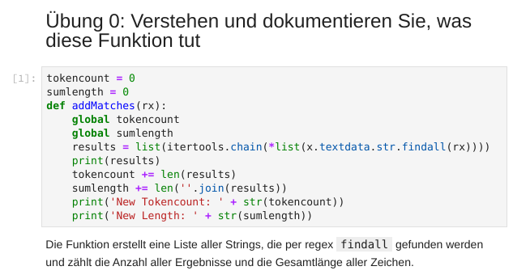
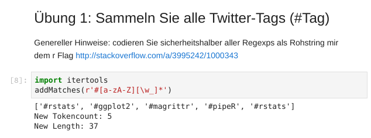
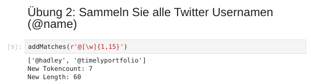
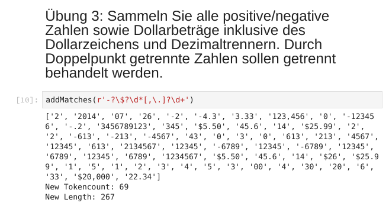

Wir haben hier zwei Zeichen mehr im String, da wir `-.2` als reguläre Zahl finden lassen.

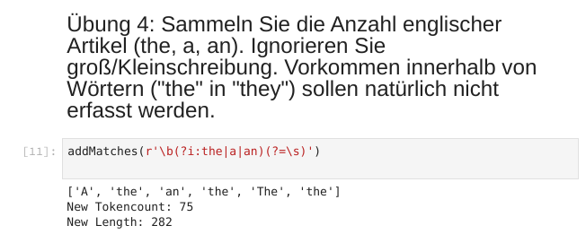
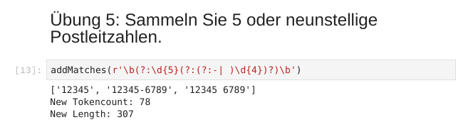
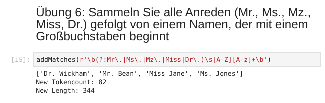
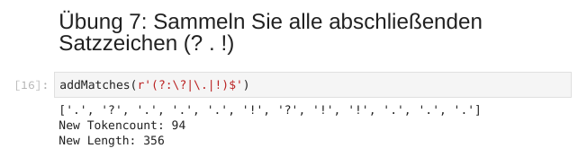
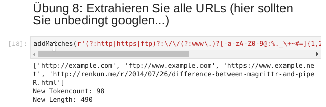
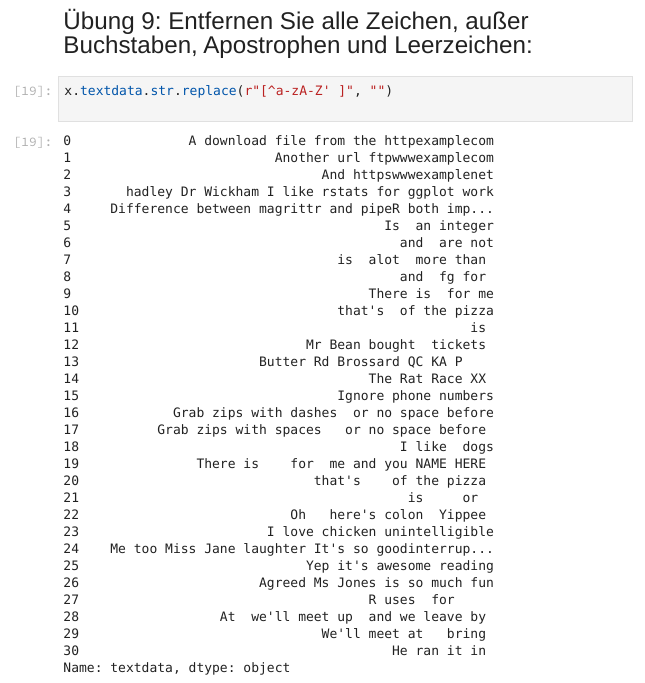
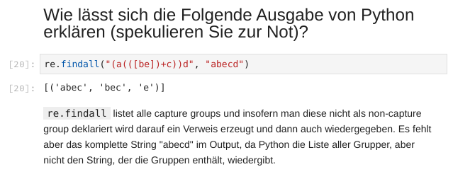
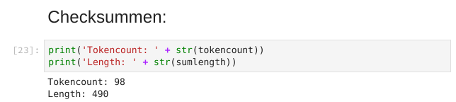

## Teil II

### 1.

#### a)

```xpath
for $p in //Pfleger[@Station='Rehabilitation']/Name
return concat($p/Vorname, ' ', $p/Nachname)
```

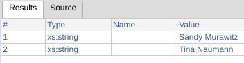

#### b)

```{xpath}
for $ x in //Stationen/Station/Standort[starts-with(.,'Seestrasse')]
return $x/..[count(Bett) > 2]
```

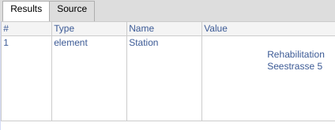

#### c)

```xpath
for $x in //Stationen/Station/@Leitung
return //Personal/angestelltes_Personal/Pfleger[@ID = $x]/Name/Nachname
```

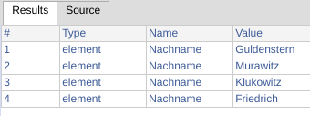

#### d)

```xpath
for $x in //Personal/*/*/Name[../Adresse/Stadt = 'Berlin']
return concat($x/Vorname, ' ', $x/Nachname)
```

### 3.

```xpath
//h1[@id="firstHeading"]/text()
//div[@class='mw-parser-output']/p[1]
//div[@class='rpBJOHq2PR60pnwJlUyP0']/div
```

Erster Audruck gibt einem die erste Überschrift aus ArchWiki Seiten.
Zweiter Audruck gibt den ersten Paragraphen, quasi den Abstract, aus ArchWiki Seiten.
Dritter Ausdruck gibt auf Reddit die Threads zurück. Die Klasse ist tatsächlich so fix. Es scheint, als wird auf Reddit mit Hashes statt lesbaren Namen gearbeitet.

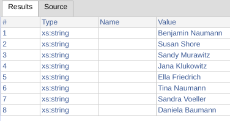

## Teil III

### 1.

Wir Crawlen als Textseite das ArchWiki, der bisher relevante teil wäre die Klassendefinition:

```python
class ArchSpider(scrapy.Spider):
  name = 'arch_spider'
  allowed_domains = ['archlinux.org']
  start_urls = ['https://wiki.archlinux.org']

  def parse(self, response):
    def text_cleaner(value):
      value = ' '.join(value)
      value = value.replace('\n', '')
      value = unicodedata.normalize("NFKD", value)
      value = re.sub(r' , ', ', ', value)
      value = re.sub(r' \( ', ' (', value)
      value = re.sub(r' \) ', ') ', value)
      value = re.sub(r' \)', ') ', value)
      value = re.sub(r'\[\d.*\]', ' ', value)
      value = re.sub(r' +', ' ', value)
      return value.strip()

    # if article page, retriev title
    if response.url.startswith('https://wiki.archlinux.org/'):
      title = response.xpath('//h1[@id="firstHeading"]/text()').extract_first()
      content = response.xpath("//div[@class='mw-parser-output']/p[1]")
      text = content.xpath("string()").extract()
      # text = []
      # for node in content:
      #   text_string = node.xpath('string()').extract_first()
      #   if len(text_string):
      #     text.append(text_string)
      yield {
          'url': response.url,
          'title': title,
          'content': text_cleaner(text)
      }

    if response.url.startswith('https://wiki.archlinux.org'):
      links = response.xpath("//a/@href").extract()
      for link in links:
        if link:
          absolute_next_page_url = response.urljoin(link)
          print(absolute_next_page_url)
          yield scrapy.Request(absolute_next_page_url)
```

Als Textseite crawlen wir das ArchWiki.
Wir beschränken die Daten auf die URL, den Seitentitel und den ersten Paragraphen. Der erste Paragraph sellt üblicherweise einen Abstract dar.
Die Seiten sind sehr gut strukturiert und das größte Hindernis ist scrapy und xpath lernen. Es besteht eventuell noch Verbesserungsbedarf. Wikitypisch gibt es die Seiten in mehreren Sprachen. Eventuell könnte man noch schauen, wie man nur `Talk` Kategorien gefunden. Diese könnte man eventuell auch ausschließen, da nicht klar ist, wie relevant diese eigentlich sein können.
Der ArchCralwer wurde vorerst mit `'CLOSESPIDER_PAGECOUNT': 3000` beschränkt, was `2888` Seiten und deren Inhalt liefert. Manche von diesen Seiten haben keinen Inhalt. Dies kann man noch genauer untersuchen.

Als Linkseite crawlen wir Reddit und davon speziell vorerst `r/news`.
Wir extrahieren hier den Link von wo `from` man nach wo `to` referenziert wird mit dem Namen vom Link. Auch Reddit ist gut strukturiert und das finden der Links war auch kein Problem. Die Seite lädt dynamisch, aber es gibt auch eine `next` Funktion, welche wir nutzen, um weitere Seiten zu laden.
Der RedditCrawler wurde vorerst mit `'CLOSESPIDER_PAGECOUNT': 1000` beschränkt, was `97` Links ausgehend von der newspage liefert, da es sich herausstellte, dass Reddit, obwohl es den eindruck (durch das dynamische Nachladen), nur knapp unter 100 Threads aktiv pro Subreddit behält.

```python
class RedditSpider(scrapy.Spider):
    EXTENSIONS = {
        'scrapy.extensions.closespider.CloseSpider': 500
    }
    name = 'RedditSpider'
    start_urls = ['https://www.reddit.com/r/news/']

    def parse(self, response):
        if ("reddit.com/r/news/" in response.url):
            topicList = response.xpath("//div[@class='rpBJOHq2PR60pnwJlUyP0']/div")
            for topic in topicList:
                url = topic.xpath(".//div[2]/article/div/div[3]/a/@href").extract()
                title = topic.xpath(".//h3/text()").extract()

                if(not len(url) == 0 and not len(title) == 0):
                    yield {'from': response.url, 'to': url, 'title': title}

            #Calls new Pages
            next_page = response.xpath('//link[@rel="next"]/@href').extract_first()
            if next_page is not None:
                yield response.follow(next_page, self.parse)
```

### 2/3

Beiliegend als jupyter Notebooks.
