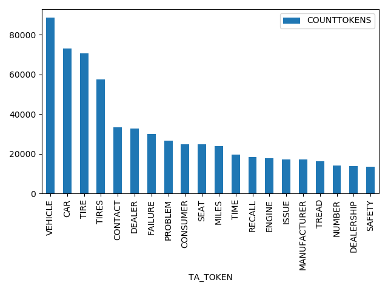
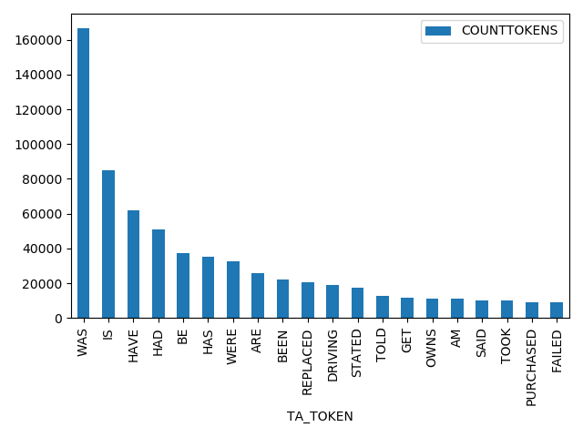
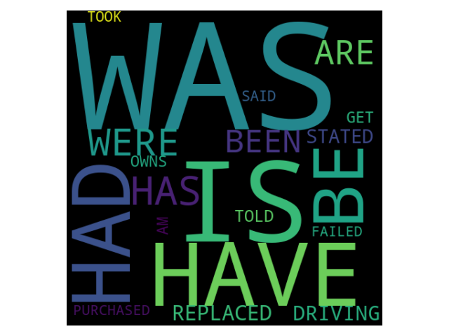
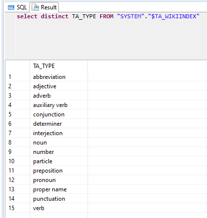
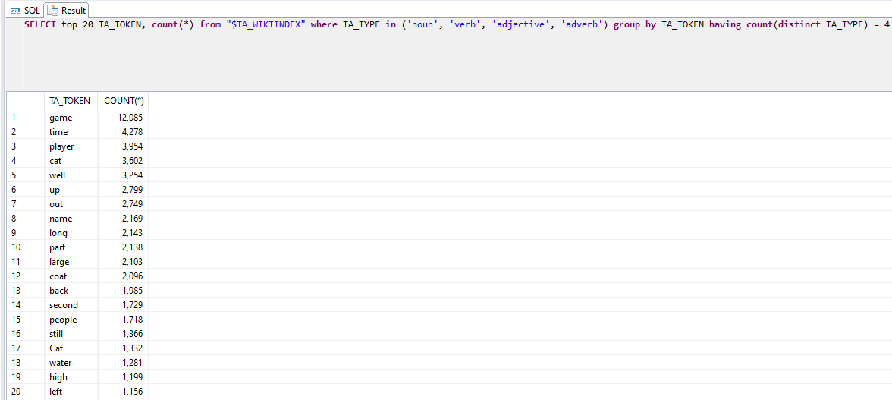
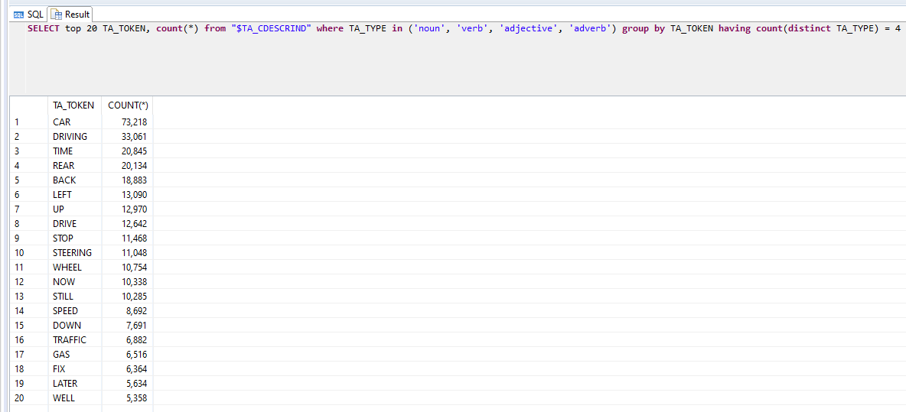
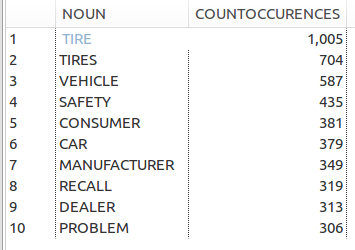
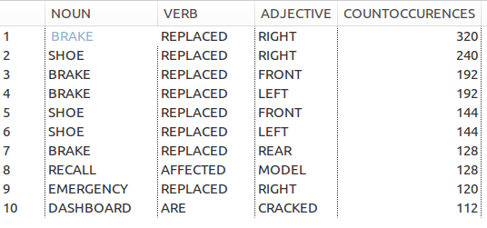

# TWM, Praktikumsbericht 2

Gruppe ZA: Denis Fedjakin, Marius Gabler, Maximilian Neudert

---

<script type="text/javascript" src="http://cdn.mathjax.org/mathjax/latest/MathJax.js?config=TeX-AMS-MML_HTMLorMML"></script>
<script type="text/x-mathjax-config">
    MathJax.Hub.Config({ tex2jax: {inlineMath: [['$', '$']]}, messageStyle: "none" });
</script>

## Notizen

Eclipse mit Hana plugin selbst installieren ist eine Katastrophe. Eclipse Version muss mit der HanaDB Version übereinstimmen. Das heißt praktisch, dass man Eclipse Neon mit SAP Hana Tools für Neon "https://tools.hana.ondemand.com/neon/" nutzen muss.

## Teil I

1.

Wenn man sich an die Anleitung hält und das richtige Eclipse installiert ist, dann ist die Verbindung kein Problem und testweise kann man folgendes Statement absetzen:

```sql
select top 10 * from SYSTEM.CMPL100k
```

2.

Wir erstellen eine Tabelle "WIKI" mit ID, CAT = Kategorie, TITLE, URL und TEXT = Dokumentinhalt (Artikeltext aus Wikipedia).

```sql
CREATE COLUMN TABLE "SYSTEM"."WIKI" (
  "ID" bigint not null primary key generated by default as IDENTITY,
  "TITLE" VARCHAR(2000),
<<<<<<< HEAD
  "URL" VARCHAR(2000),
  "TEXT" CLOB MEMORY THRESHOLD 1048576)
=======
  "TEXT" CLOB MEMORY THRESHOLD 100000,
  "URL" VARCHAR(2000))
>>>>>>> 1c60a6fd24f0c0be132b60059a569f9cfc60b8d9
```

3.

Wir testen in einer weiteren Testdatenbank die import SQL statements bevor wir in Python den vollautomatischen Block implementieren:

```sql
drop table "SYSTEM"."WIKI-TEST"
insert into "SYSTEM"."WIKI-TEST" (NAME, DESCRIPTION, URL) VALUES ("TESTCAT","TEST","https://test.test.test","Blindtext")
select * from "SYSTEM"."WIKI-TEST"
```

Dies funktioniert, also folgt die Implementation für die Spider (Auszug der für Hana relevanten Teile):

```python
hana_ip = '52.17.42.3'
cursor = hana_init(hana_ip, 39015, 'SYSTEM', 'Glorp2018!')
# [...]
def hana_upload(cursor, data):
  cat = data[0].replace("'", "''")
  title = data[1].replace("'", "''")
  url = data[2].replace("'", "''")
  text = data[3].replace("'", "''")
  sql = f"insert into \"SYSTEM\".\"WIKI\" (CAT, TITLE, URL, TEXT) VALUES ('{cat}','{title}','{url}','{text}')"
  cursor.execute(sql)
# [...]
# don't upload empty or broken data
if not None in data:
  global cursor
  hana_upload(cursor, data)
  print(f' -> Upload: {data[0]} > {data[1]} > {data[1]}')
  # return for scrapy
  yield item
```

4.

Wir prüfen den Import der Daten durch `count(*)` und einfache Sichtung:

```sql
select count(*) from "SYSTEM"."WIKI"
select min(ID) from "SYSTEM"."WIKI" group by CAT
select * from "SYSTEM"."WIKI" where ID in (1,1401,2450,3519,4606)
```

Die Anzahl der Daten stimmt mit der ausgegebenen Anzahl von scrapy in der Konsole überein.
Die Daten sehen bei manueller Sichtung auch vollkommen in Ordnung aus und entsprechen der Vorstellung:


5.

SQL-Befehl:

```sql
--Create Table:
CREATE FULLTEXT INDEX "WIKIINDEX" ON "SYSTEM"."WIKI" ("TEXT")
CONFIGURATION 'LINGANALYSIS_FULL' ASYNC LANGUAGE DETECTION  ('en')
TEXT ANALYSIS ON;

--Count Token:
SELECT count(*) FROM "SYSTEM"."$TA_WIKIINDEX"

--Result: 1,426,680 Tokens
```

- Erstellt für jedes Wort und Satzzeichen ein Token/Tupel
- 'LINGANALYSIS_FULL' enthält STEM('TA_STEM') und POS-Tagging('TA_TYPE')
- Erstellt sehr viele Tupel, welche 14 Spalten haben. Kann zu hohen Speicherbedarf führen, wenn man sehr viele Dokumente hat. Da Wikipedia sehr viele lange Artikel enthält, sollte man ab einer gewissen größe davon ausgehen können, dass die Menge der Tokens nur noch mit Fachbegriffen, also langsam, wächst. Unsere Datenbank enthält `5660` Dokumente und diese führen zu `1 426 680` Tokens. Das sind etwa 300 Token pro Artikel.

6.

Die Inhalte der ausgegebenen Spalten haben wir hier [hier](https://help.sap.com/viewer/62e301bb1872437cbb2a8c4209f74a65/2.0.00/en-US/e580220fc1014045ab9f45ea9f82d8d8.html) und [hier](https://blogs.sap.com/2017/05/21/sap-hana-ta-text-analysis/) nachgelesen. Wichtig war insbesondere folgende Aussagen:

- `TA_RULE`: The rule that created the output. Generally, this is either LXP for linguistic analysis or Entity Extraction for entity and fact analysis.
- `TA_TOKEN`: The term, entity, or fact extracted from the document. In linguistic analysis, this is the tokenized term before stemming and normalization.In entity and fact extraction, it is the segment of the original text identified as an entity or sub-entity.

Für die angegebene Methode werden die Tokens auf Basis von Stemming generiert. Als Alternative gibt es:

#### LINGANALYSIS_BASIC

Enables the most basic linguistic analysis. This tokenizes the document, but does not perform normalization or stemming. The TA_TYPE field will not identify the part of speech, and the TA_NORMALIZED and TA_STEM columns will be empty.

#### LINGANALYSIS_STEMS

Normalizes and stems the tokens. The TA_TYPE field will still not contain the part of speech, but the normalized and stemmed forms will be populated.

#### LINGANALYSIS_FULL

Performs full linguistic analysis. In addition to the normalized and stemmed forms, the TA_TYPE column will be populated with parts of speech. This is the most detailed level of linguistic data available.

#### EXTRACTION_CORE

Extracts basic entities from the text, including people, places, firms, URLs, and other common terms.

#### EXTRACTION_CORE_VOICEOFCUSTOMER

Extracts additional entities and facts beyond the core configuration to support sentiment and request analysis. This configuration is essential because it identifies positive and negative emotions associated with tokens, allowing us to gauge opinion within a corpus to particular topics.

#### EXTRACTION_CORE_ENTERPRISE

Provides extraction for enterprise data, such as mergers, acquisitions, organizational changes, and product releases. This configuration focuses on businesses and professional organizations and is often used to monitor public references to partners or competitors within an industry.

#### EXTRACTION_CORE_PUBLIC_SECTOR

Extracts security-related data about public persons, events, and organizations. This data is of limited use for general analysis.

6.

Indexvariante EXTRACTION_CORE_VOICEOFCUSTOMER:

```sql
--Create Table:
CREATE FULLTEXT INDEX "WIKIINDEX" ON "SYSTEM"."WIKI" ("TEXT")
CONFIGURATION 'EXTRACTION_CORE'
TEXT ANALYSIS ON;

--Count Token:
SELECT count(distinct TA_COUNTER) FROM "SYSTEM"."$TA_WIKIINDEX"
```

Mit dem `count(distinct)` statement können wir die verschiedenen Tokens zählen. Für `LINGANALYSIS_FULL` erhalten wir knapp `16311` verschiedene Tokens und für `EXTRACTION_CORE` knapp `2600` verschiedene Tokens. Man mekrt also, dass `EXTRACTION_CORE` gruppiert und somit die Tokens grobgranularer macht.
Unsere Daten sind weitesgehend sauber. Es könnte Probleme geben, wenn zum Beispiel HTML Tags gecrawled werden, denn diese würden eventuell später die Textanalyse verzerren.
Wir behalten vorerst den `LINGANALYSIS_FULL`.

## Teil II

1.

Erstelle View für Worthäufigkeit pro Dokument:

```sql
CREATE VIEW cmplWordCount AS
SELECT CMPLID, TA_TYPE, TA_TOKEN, COUNT("TA_TOKEN") AS NumberOfTokens
FROM "SYSTEM"."$TA_CDESCRIND"
WHERE TA_TYPE = 'noun'
GROUP BY CMPLID, TA_TYPE, TA_TOKEN
ORDER BY NumberOfTokens DESC;
```

```sql
CREATE VIEW wikiWordCount AS
SELECT ID, TA_TYPE, TA_TOKEN, COUNT("TA_TOKEN") AS NumberOfTokens
FROM "SYSTEM"."$TA_WIKIINDEX"
WHERE TA_TYPE = 'noun'
GROUP BY ID, TA_TYPE, TA_TOKEN
ORDER BY NumberOfTokens DESC;
```

Wir können uns dann die views anzeigen lassen mittels:

```sql
select top 10 * from wikiwordcount
```

2.

- Wie groß ist Ihr Lexikon?

SQL-Befehl:

```sql
SELECT count(*) FROM "SYSTEM"."$TA_CDESCRIND"
-- Result: 10,413,422
SELECT count(*) FROM "SYSTEM"."$TA_WIKIINDEX"
-- Result: 3,947,136
```

- Wie groß ist Ihr Lexikon, wenn Sie bestimmte irrelevante Wortgruppen (z.B. Artikel) ausschließen?

SQL-Befehl:

```sql
SELECT count(*) FROM "SYSTEM"."$TA_CDESCRIND" where not TA_TOKEN = 'THE'
-- Result: 9,728,146
SELECT count(*) FROM "SYSTEM"."$TA_WIKIINDEX" where not TA_TOKEN = 'THE'
-- Result: 3,947,108
```

- Was ist die durchschnittliche Länge eines Dokuments?

```sql
SELECT AVG(LENGTH(TEXT)) FROM "SYSTEM"."WIKI"
-- Result: 3,637
SELECT AVG(LENGTH(CDESCR)) FROM "SYSTEM"."CMPL100K"
-- Result: 508
```

- Was ist die durchschnittliche Länge eines Satzes?

Hier haben wir zwei Ansätze. Einmal mittels einer Funktion, die sehr langsam ist, aber alles eigentlich gründlich aufzählt:

Funktion zur Berechnung der Funktion:

```sql
def getAverageSentenceLength():
    cursor.execute('SELECT TOP 10000 CMPLID, TA_TOKEN, TA_SENTENCE FROM "SYSTEM"."$TA_CDESCRIND" ORDER BY CMPLID, TA_SENTENCE;')

    totalLength = 0
    documentID = -1

    SentenceNumber = -1
    countSentence = 0
    for row in cursor:
        if (row[0] != documentID):
            documentID = row[0]
            SentenceNumber = row[2]
            countSentence = countSentence + 1

        if(row[2] != SentenceNumber):
            SentenceNumber = row[2]
            countSentence = countSentence + 1

        # print(row[1])
        totalLength = totalLength + len(row[1])

    print("Number Sentences:")
    print(countSentence)
    print("Average Length:")
    print(totalLength/countSentence)
```

Ergebnis:

Number of analyzed Sentences: 524

Average Length of a Sentence: 78.05

Die Python Variante ist leider sehr langsam und dient damit bestenfalls als Approximation, um den Algorithmus zu vergleichen.
Die andere Methode per SQL. Die Idee ist, dass in `TA_OFFSET` die Position im Dokument steht, sprich wenn man danach gruppiert

```sql
select avg(count) from (SELECT SUM(LENGTH(TA_TOKEN)) as count FROM "SYSTEM"."$TA_WIKIINDEX" group by ID, TA_SENTENCE)
-- Result: 112.946782
select avg(count) from (SELECT SUM(LENGTH(TA_TOKEN)) as count FROM "SYSTEM"."$TA_CDESCRIND" group by CMPLID, TA_SENTENCE)
-- Result: 74.614716
```

- Welchen (quantitativen) Effekt hätte Lemmatisierung bzgl. Ihres Lexikons?

Es würde die Wörter zu deren 'Stammwörter' normalisieren. Wenn man auf diese dann eine Worthäufigkeitsanlyse durchführen würde, würde man ein besseres Ergebnis erhalten.

Zum Beispiel ist das häufigste auftreffende Wort `VEHICLE`. Wenn man aber das dritt und viert häufigste Wort zusammenlegt, da diese denselben Wortstamm haben, dann ist das häufigste Wort `TIRE`.


3.

Siehe jupyter Notebook `p2`.

- Most used Words:
  
  

- Least used Words:
  
  

- Most used Nouns:
  
  

- Most used Verbs:
  
  

- Most used Adjectives:
  
  

4.

Zuerst schauen wir, welche Tags wir in `TA_TYPES` überhaupt finden:

```sql
select distinct TA_TYPE FROM "SYSTEM"."$TA_WIKIINDEX"
```



Damit können wir nun nach mehrdeutigen Wörtern suchen gehen.

```sql
SELECT top 20 TA_TOKEN, count(*) from "$TA_WIKIINDEX" where TA_TYPE in ('noun', 'verb', 'adjective', 'adverb') group by TA_TOKEN having count(distinct TA_TYPE) = 4 order by count(*) desc
```



```sql
SELECT top 20 TA_TOKEN, count(*) from "$TA_CDESCRIND" where TA_TYPE in ('noun', 'verb', 'adjective', 'adverb') group by TA_TOKEN having count(distinct TA_TYPE) = 4 order by count(*) desc
```



5.

Siehe jupyter Notebook `p2`.

Wenn in einen Satz 'defect' vorkommt, dann gib das Nomen im Satz an.

```sql
SELECT n."TA_TOKEN" as noun, count(*) as CountOccurences
FROM "SYSTEM"."$TA_CDESCRIND" n, "SYSTEM"."$TA_CDESCRIND" a
WHERE n."TA_TYPE" = 'noun' AND (a."TA_TYPE" = 'noun' OR a."TA_TYPE" = 'adjective')
AND n.CMPLID = a.CMPLID AND n.TA_SENTENCE = a.TA_SENTENCE
AND a."TA_TOKEN" = 'DEFECT' AND NOT n."TA_TOKEN" = 'DEFECT'
GROUP BY n."TA_TOKEN"
ORDER BY count(*) DESC;
```

Ergebnis:

Am Ergebnis kann man erkennen, dass das am häufigste defekte Autoteil die Reifen sind.



Als Wordcloud:


Die 10 häufigste Kombination von Nomen, Verb und Adjektiven in einen Satz

```sql
SELECT TOP 10 n."TA_TOKEN" as Noun, v."TA_TOKEN" as Verb, a."TA_TOKEN" as Adjective,  count(*) as CountOccurences
FROM "SYSTEM"."$TA_CDESCRIND" n, "SYSTEM"."$TA_CDESCRIND" v, "SYSTEM"."$TA_CDESCRIND" a
WHERE n.CMPLID = v.CMPLID AND v.CMPLID = a.CMPLID AND n.TA_SENTENCE = v.TA_SENTENCE AND v.TA_SENTENCE = a.TA_SENTENCE
AND n."TA_TYPE" = 'noun' AND v."TA_TYPE" = 'verb' AND a."TA_TYPE" = 'adjective'
GROUP BY n."TA_TOKEN", v."TA_TOKEN", a."TA_TOKEN", n.CMPLID , n."TA_SENTENCE"
ORDER BY count(*) DESC;
```

Ergebnis:

Wie man am Ergebnis sehen kann, ist die am häufigsten auftretende Beschwerde, dass anscheinend Bremsen ersetzt werden müssen.


