# TWM, Praktikumsbericht 3

Gruppe ZA: Denis Fedjakin, Marius Gabler, Maximilian Neudert

---

<script type="text/javascript" src="http://cdn.mathjax.org/mathjax/latest/MathJax.js?config=TeX-AMS-MML_HTMLorMML"></script>
<script type="text/x-mathjax-config">
    MathJax.Hub.Config({ tex2jax: {inlineMath: [['$', '$']]}, messageStyle: "none" });
</script>

## Teil I

### 1.

Das ist nun ohne non-equi auto-join, aber es funktioniert.

```sql
select top 100 "adj", "noun", count(*) as "count" from
(SELECT W1.TA_TOKEN as "adj",
        W2.TA_TOKEN as "noun",
        W2.TA_COUNTER - W1.TA_COUNTER as diff
FROM "SYSTEM"."$TA_WIKIINDEX" W1
INNER JOIN "SYSTEM"."$TA_WIKIINDEX" W2
  ON W1.ID = W2.ID
  AND W1.TA_COUNTER < W2.TA_COUNTER
  AND W1.TA_TYPE = 'adjective'
  AND W2.TA_TYPE = 'noun')
where diff = 1
group by "adj", "noun"
order by "count" desc
```

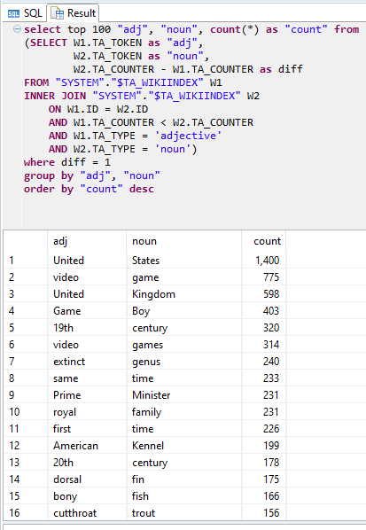

America First. Eigentlich nicht verwundernswert, dass im englischen Wikipedia 'United States' das häuigste Bigram ist. Praktisch könnte man es aber auch ignorieren, da es ein Eigenname ist.
Man merkt, dass über `1000` Seiten zu video games abgelaufen wurden.
Richtig interessante Bigrame sind dann `same time` oder `extinct genus`.

```sql
select top 100 "adj", "noun", count(*) as "count" from
(SELECT W1.TA_TOKEN as "adj",
        W2.TA_TOKEN as "noun",
        W2.TA_COUNTER - W1.TA_COUNTER as diff
FROM "SYSTEM"."$TA_CDESCRIND" W1
INNER JOIN "SYSTEM"."$TA_CDESCRIND" W2
  ON W1.CMPLID = W2.CMPLID
  AND W1.TA_COUNTER < W2.TA_COUNTER
  AND W1.TA_TYPE = 'adjective'
  AND W2.TA_TYPE = 'noun')
where diff = 1
group by "adj", "noun"
order by "count" desc
```

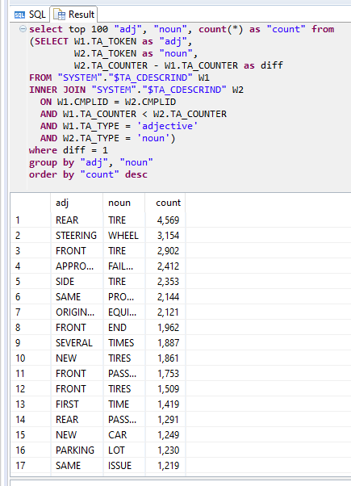

Wir stellen fest, dass besonders häufig über `Rear Tire` und `Steering Wheel` beschwert wird.
Das Lenkrad ist besonders interessant, da dort, nach bekannten Skandal, viele defekte Airbags verbaut waren.

### 2.

Die Aufgabe ist analog zu 1.

```sql
select top 100 "adj1", "adj2", count(*) as "count" from
(SELECT W1.TA_TOKEN as "adj1",
        W2.TA_TOKEN as "adj2",
        W2.TA_COUNTER - W1.TA_COUNTER as diff
FROM "SYSTEM"."$TA_WIKIINDEX" W1
INNER JOIN "SYSTEM"."$TA_WIKIINDEX" W2
  ON W1.ID = W2.ID
  AND W1.TA_COUNTER < W2.TA_COUNTER
  AND W1.TA_TYPE = 'adjective'
  AND W2.TA_TYPE = 'adjective')
where diff = 1
group by "adj1", "adj2"
order by "count" desc
```

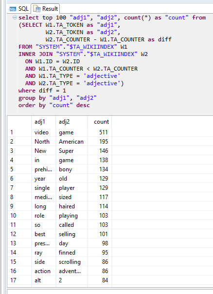

```sql
select top 100 "adj1", "adj2", count(*) as "count" from
(SELECT W1.TA_TOKEN as "adj1",
        W2.TA_TOKEN as "adj2",
        W2.TA_COUNTER - W1.TA_COUNTER as diff
FROM "SYSTEM"."$TA_CDESCRIND" W1
INNER JOIN "SYSTEM"."$TA_CDESCRIND" W2
  ON W1.CMPLID = W2.CMPLID
  AND W1.TA_COUNTER < W2.TA_COUNTER
  AND W1.TA_TYPE = 'adjective'
  AND W2.TA_TYPE = 'adjective')
where diff = 1
group by "adj1", "adj2"
order by "count" desc
```

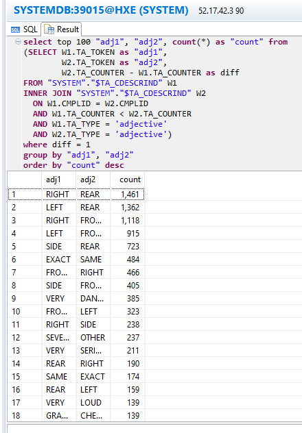

### 3.

Berechnung innerhalb der NHTSA-Complaints - Daten:

Gewählter Term: TIRES

Berechnung idf:

```sql
SELECT log(10, CountTotal/CountDocumentWithTerm) as idf
FROM (SELECT count(distinct CMPLID) as CountTotal FROM "SYSTEM"."$TA_CDESCRIND") AS total
,(SELECT count(distinct CMPLID) as CountDocumentWithTerm FROM "SYSTEM"."$TA_CDESCRIND" WHERE "TA_TOKEN" = 'TIRES') as term
```

Ergebnis für idf:

idf=0.633906972540246

Berechnung $tf \cdot idf$:

```sql
SELECT TOP 3 total.CMPLID, (CountTerm / CountTotal) as tf,(0.633906972540246) as idf , ((CountTerm / CountTotal) * 0.633906972540246) as "tf*idf"
FROM (SELECT CMPLID, count(*) as CountTotal FROM "SYSTEM"."$TA_CDESCRIND" GROUP BY CMPLID) AS total
,(SELECT CMPLID, count(*) as CountTerm FROM "SYSTEM"."$TA_CDESCRIND" WHERE "TA_TOKEN" = 'TIRES' GROUP BY CMPLID) as term
WHERE total.CMPLID = term.CMPLID
ORDER BY "tf*idf" DESC;
```

Ausgabe der Top 3 $tf \cdot idf$:

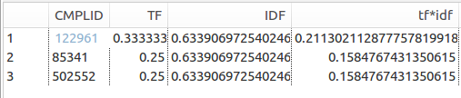

Berechnung für den Term 'AIRBAG' (SQL-Befehle der übersichkeitshalber ausgellasen):

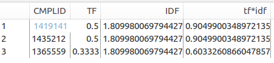

Nun mit den Daten von Wikipedia:

Term: cat

```sql
--idf = 0.9074113607745862
SELECT CountTotal,CountDocumentWithTerm, log(10, CountTotal/CountDocumentWithTerm) as idf
FROM (SELECT count(distinct ID) as CountTotal FROM "SYSTEM"."$TA_WIKIINDEX") AS total
,(SELECT count(distinct ID) as CountDocumentWithTerm FROM "SYSTEM"."$TA_WIKIINDEX" WHERE "TA_TOKEN" = 'cat') as term


--tf*idf
SELECT TOP 3 total.ID, (CountTerm / CountTotal) as tf,(0.9074113607745862) as idf , ((CountTerm / CountTotal) * 0.9074113607745862) as "tf*idf"
FROM (SELECT ID, count(*) as CountTotal FROM "SYSTEM"."$TA_WIKIINDEX" GROUP BY ID) AS total
,(SELECT ID, count(*) as CountTerm FROM "SYSTEM"."$TA_WIKIINDEX" WHERE "TA_TOKEN" = 'cat' GROUP BY ID) as term
WHERE total.ID = term.ID
ORDER BY "tf*idf" DESC;
```

Ausgabe:

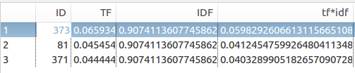

Berechnung des $tf \cdot idf$ für den Term 'country':

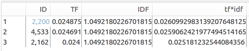

### 4.

Ausführliche Durchführung im Notebook `p3`.
Der chi²-Test prüft auf die Nullhypothese, ob es einen signifikanten Abstand zwischen erwarteter Häufigkeit und gemessener Häufigkeit gibt.
Ein kleiner chi²-Testwert bedeutet, dass die gemessene Häufigkeit der erwarteten Häufigkeit entspricht -> Die Klasse ist abhängig von den Daten.
Ein groß chi²-Testwert bedeutet, dass es einen signifikanten Unterschied zwischen gemessener Häufigkeit und erwarteter Häufigkeit gibt -> Die Klasse ist unabhängig von den Daten.
Für Klassifikation interessieren uns die Klassen, die die höchste Abhängigkeit von den Daten aufweisen. Sprich die 3 statistisch signifikantesten haben die kleinsten Teststatistiken und die wenigsten signifikantesten die höchste.
Wir erhalten als Ergebnis:

1. 'rear tire' mit einem Score von 10184
2. 'spare tire' mit einem Score von 6271
3. 'side tire' mit einem Score von 4537

### 5.

Zuerst machen wir uns eine übersicht über die größe des Wortvektors. Der ist ziemlich groß für Wikipedia und halb so groß für die Autos. Mit ähnlichen queries bauen wir dann die Ähnlichkeitsvektoren auf.
Wir beschränken uns dabei auch auf Nomen, die mehr als drei mal vorkommen.

```sql
select count(distinct TA_TOKEN) from "SYSTEM"."$TA_WIKIINDEX" where TA_TYPE = 'noun'
-- result: 40506
select count(distinct TA_TOKEN) from "SYSTEM"."$TA_CDESCRIND" where TA_TYPE = 'noun'
-- result: 23942
---
--- vector words
---
select TA_TOKEN from
(select TA_TOKEN, count(*) as "count"
from "SYSTEM"."$TA_WIKIINDEX"
where TA_TYPE = 'noun'
group by TA_TOKEN order by count(*) desc)
where "count" > 3
-- count: 16477
select TA_TOKEN from
(select TA_TOKEN, count(*) as "count"
from "SYSTEM"."$TA_CDESCRIND"
where TA_TYPE = 'noun'
group by TA_TOKEN order by count(*) desc)
where "count" > 3
-- count: 9388
```

Um 'etwas schönerere Vektoren' zu erhalten sortieren wir die Wörter für den Vektor nach ihrer Häufigkeit.
Wobei sich heraus stellte, dass dies dann doch irrelevant ist.
Rest im jupyter notebook `p3`.

### 6.

Wir erhalten, dass zur gegebenen Beschwerden ein Duplikat `119409` existiert und die Beschwerden `88979, 119746, 44792` sehr ähnlich sind.
Ausführliches dazu im Notebook `p3`.

### 7.

Ausführliches dazu im Notebook `p3`. Wir gehen analog zu 6. vor.
Wir verwenden als Anker [International Cat Day](https://en.wikipedia.org/wiki/International_Cat_Day).
Erste Erkenntnis ist, dass auf langen Textcorpi, wie Wikipedia, der identische Arikel 'nur' noch eine Ähnlichkeit von `0.99999994`.
Es findet sich danach noch ein Artikel mit einer Ähnlichkeit von etwa 61%.
Dies ist der [National Cat Day](https://en.wikipedia.org/wiki/National_Cat_Day). Das Ergebnis ist hervorragend, denn die Artikel sind fast gleich. Man könnte dies sogar bei Wikipedia als Verbesserungsvorschlag einreichen, da die Artikel eigentlich Duplikate sind.
Danach liegen die nächsten Scores bei etwas über 30% wie [Cashire Cat](https://en.wikipedia.org/wiki/Cheshire_Cat). Was absolut in Ordnung ist, da es immerhin mit Katzen zu tun hat.

## Teil II

### 1.

Vollständig zu finden im Notebook `p3`.

### 2.

Die Precision-Recall Kurve gibt den tradeoff zwischen Precision und Recall wieder.

```python
q1 = {'AIR': 1, 'BAG': 1}
```

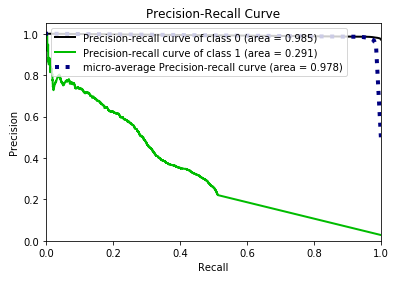

```python
q2 = {'AIR': 1, 'BAG': 1, 'ACCIDENT':1}
```

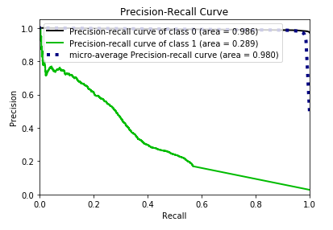

```python
q3 = {'AIR': 1, 'BAG': 1, 'FIRE': 1}
```

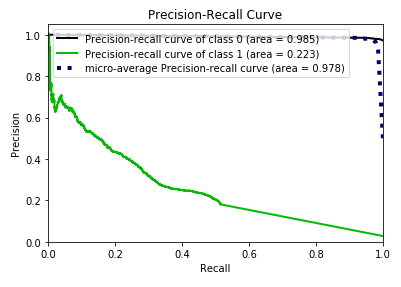

```python
q4 = {'AIR': 2, 'BAG': 2, 'DEPLOYMENT':2, 'ACCIDENT':2}
```

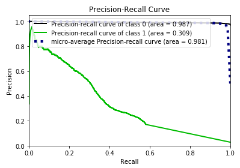

Wir erkennen, dass wir für die sinnvollen Anfragen für die ersten paar Dokumente eine sehr gute Precision haben. Für hohen Recall, also also Dokukente, die mit `air bags` klassifiziert wurden, zu finden, büßen wir doch sehr schnell Genauigkeit ein.
Dafür ist die Genauigkeit für enthält keine Airbags sehr hoch. Dies wird aber insbesondere auch daran liegen, dass die meisten Dokumente nicht für Airbags kategorisiert sind und man somit generell weniger Fehler machen kann.
Die AUC ist ein Maß für die Güte der Anfrage und da ist die vorgegebene Anfrage `q4` mit kleinem Abstand die Beste.

Zum Vergleich haben wir noch eine 'bullshit' query erstellt.
Sprich, was erhalten wir, wenn wir Müll suchen. Das Ergebnis ist, dass die Precision sehr niedrig ist - was auch gut ist. Wer nach `bull shit` sucht sollte nunmal auch keine Beschwerden über Airbags finden. Die Kurven verhalten sich wie zu erwarten entgegengesetzt zu einer vernünftigen Suche.

```python
q5 = {'BULL': 2, 'SHIT': 2}
```

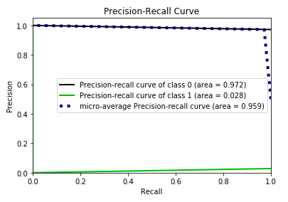

## Teil III

### 2.

Ein Freiheitsgrad ist die Menge der Wörter zu erhöhen oder verringern, die ein Shingle repräsentieren.

Ergebniss des Shingling mit 3 Wörter(bei 1000 Dokumente):

Wie man an der Tabelle unten sehen kann, wurde alle 10 tatsächlich Ähnliche auch vom Algorithmus als als ähnlich erkannt (true positive). Es wurde aber auch 3 Dokumente als ähnlich eingestuft, welche nach der Wahrheitstabelle nicht ähnlich sind (false positive). Der daraus resultierende average precision-recall score ist 0.77.

```bash
                   Est. J   Act. J
   t980 --> t2023   1.00     0.98
  t1088 --> t5015   1.00     0.98
  t1297 --> t4638   1.00     0.98
  t1768 --> t5248   1.00     0.98
  t1952 --> t3495   1.00     0.98
  t2535 --> t8642   1.00     0.98
  t2839 --> t9303   1.00     0.98
  t2957 --> t7111   1.00     0.98
  t3268 --> t7998   1.00     0.98
  t3384 --> t3385   1.00     0.06   false positive
  t3466 --> t7563   1.00     0.98
  t3588 --> t9249   1.00     0.01   false positive
  t9702 --> t9705   1.00     0.05   false positive


True positives:  10 / 10
False positives: 3
Average precision-recall score: 0.77
```

Ergebniss des Shingling mit 5 Wörter(bei 1000 Dokumente):

An der Tabelle unten kann man sehen, dass immernoch alle true positives gefunden wurden, aber es nun mehr false positives gibt und der average precision-recall score gesunken ist.

```bash
                  Est. J   Act. J
   t124 -->  t160   1.00     0.07	false positive
   t980 --> t2023   1.00     0.96
  t1088 --> t5015   1.00     0.96
  t1297 --> t4638   1.00     0.97
  t1768 --> t5248   1.00     0.96
  t1952 --> t3495   1.00     0.96
  t2181 --> t2182   1.00     0.08	false positive
  t2535 --> t8642   1.00     0.97
  t2839 --> t9303   1.00     0.97
  t2957 --> t7111   1.00     0.97
  t3268 --> t7998   1.00     0.96
  t3466 --> t7563   1.00     0.97
  t4761 --> t4765   1.00     0.04	false positive
  t5371 --> t5377   1.00     0.06	false positive
  t5371 --> t5502   1.00     0.07	false positive
  t5377 --> t5502   1.00     0.06	false positive
  t9891 --> t9893   1.00     0.06	false positive


True positives:  10 / 10
False positives: 7
Average precision-recall score: 0.59
```

Ergebniss des Shingling mit 1 Wort(bei 1000 Dokumente):

Der übersichkeitshalber werden diesmal nur die Ergebnisse des Algorithmus angezeigt. Es wurden immernoch alle true positives gefunden, doch wurde diesmal auch über die Hälfte aller Dokumente als ähnlich eingestuft (false positives), was zu einer average precision-recall score von 0,02 führt.
Dieses Ergebnis lässt sich daran erklären, dass jedes einzelne Wort nun verglichen wird.
Dadurch schießen Wörter, die ständig in Texten vorkommen ('the', 'and', 'while', etc.) die Ähnlichkeit stark in die Höhe, wodurch Dokumente als ähnlich betrachtet werden können, wenn sie genug solcher Wörter haben, obwohl sie nicht ähnlich sind.

```bash
True positives:  10 / 10
False positives: 613
Average precision-recall score: 0.02
```

Ein weiterer Freiheitsgrad ist die Veränderung des Random-Seeds. Der Random-Seeds wird für die Generierung des MinHashing verwendet. Wenn man diesen nun verändert, dann bilden sich neue Hashwerte, die den average recall-precision score zufällig beeinflussen können.

Random Seed : 100

```bash
                   Est. J   Act. J
   t980 --> t2023   1.00     0.98
  t1088 --> t5015   1.00     0.98
  t1297 --> t4638   1.00     0.98
  t1768 --> t5248   1.00     0.98
  t1952 --> t3495   1.00     0.98
  t2535 --> t8642   1.00     0.98
  t2839 --> t9303   1.00     0.98
  t2957 --> t7111   1.00     0.98
  t3268 --> t7998   1.00     0.98
  t3384 --> t3385   1.00     0.06   false positive
  t3466 --> t7563   1.00     0.98
  t3588 --> t9249   1.00     0.01   false positive
  t9702 --> t9705   1.00     0.05   false positive


True positives:  10 / 10
False positives: 3
Average precision-recall score: 0.77
```

Random Seed : 111

```bash
                   Est. J   Act. J
   t312 --> t6499   1.00     0.04   false positive
   t980 --> t2023   1.00     0.98
  t1088 --> t5015   1.00     0.98
  t1297 --> t4638   1.00     0.98
  t1324 --> t1519   1.00     0.05   false positive
  t1768 --> t5248   1.00     0.98
  t1952 --> t3495   1.00     0.98
  t2535 --> t8642   1.00     0.98
  t2839 --> t9303   1.00     0.98
  t2957 --> t7111   1.00     0.98
  t3268 --> t7998   1.00     0.98
  t3466 --> t7563   1.00     0.98
  t3773 --> t6541   1.00     0.03   false positive
  t3773 --> t9530   1.00     0.04   false positive
  t6541 --> t9530   1.00     0.04   false positive

True positives:  10 / 10
False positives: 5
Average precision-recall score: 0.67
```

### 3.

Damit das Shingling-Algorithmus Zeichen vergleicht statt Wörter muss die for-Schleife verändert werden, welche zuständig ist für die Generierung der Shinglings:

```python
# For each char in the document...
for index in range(0, len(CompleteDocument) - 7):
    # for index in range(0, len(line) - 4):
    # Construct the shingle text by combining 8 chars together.
    shingle = CompleteDocument[index] + " " + CompleteDocument[index + 1] + " " + CompleteDocument[index + 2] + " " + CompleteDocument[index + 3] + " " + CompleteDocument[index + 4] + " " + CompleteDocument[index + 5] + " " + CompleteDocument[index + 6] + " " + CompleteDocument[index + 7]
    # shingle = line[index : index+4]

    # Hash the shingle to a 32-bit integer.
    crc = binascii.crc32(shingle.encode()) & 0xffffffff

    # Add the hash value to the list of shingles for the current document.
    # Note that set objects will only add the value to the set if the set
    # doesn't already contain it.
    shinglesInDoc.add(crc)
```

Ausgabe des Algorithmus mit 8-Zeichen pro Shingling:

Ein ähnliches Ergebnis, wie Shingling mit 3 Wörter.

```bash
True positives:  10 / 10
False positives: 4
Average precision-recall score: 0.71
```

Ausgabe des Algorithmus mit 4-Zeichen pro Shingling:

Das Ergebnis ist noch miserabler, als der Shingling-Vergleich mit einem Wort. Es gibt nur 43 Dokumente, die nicht als ähnlich betrachtet wurden.

```bash
True positives:  10 / 10
False positives: 947
Average precision-recall score: 0.01
```

Ausgabe des Algorithmus mit 16-Zeichen pro Shingling:

Das bislang beste Ergebnis für das Shingling-Algorithmus.

```bash
True positives:  10 / 10
False positives: 2
Average precision-recall score: 0.83
```
