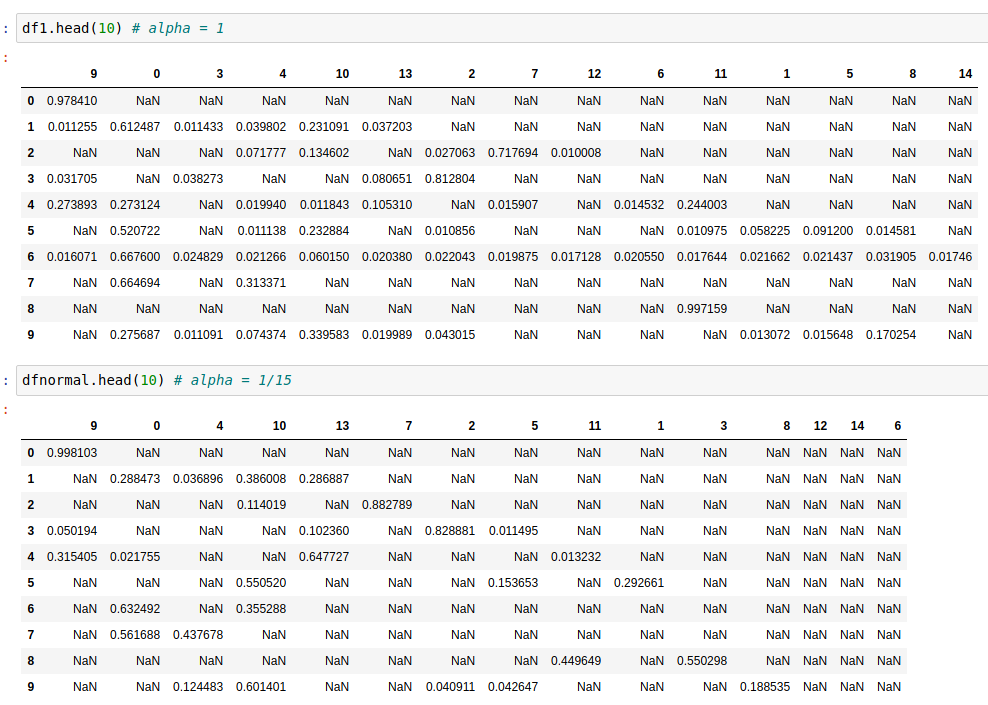
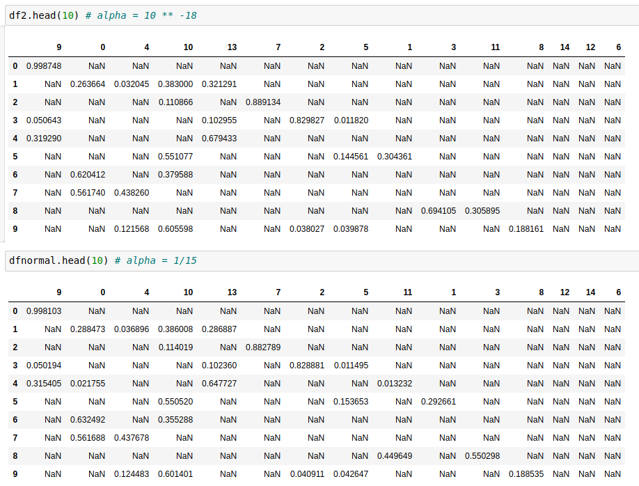
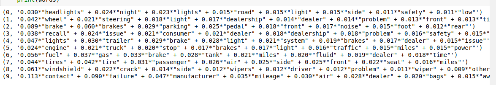
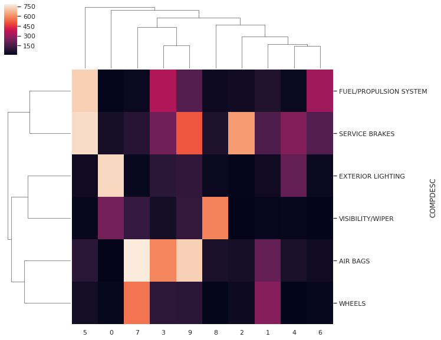
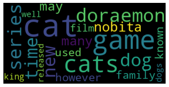
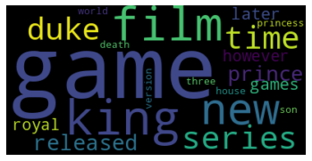
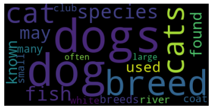
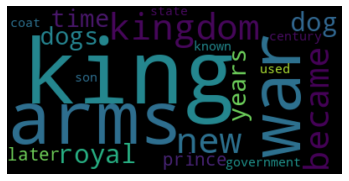
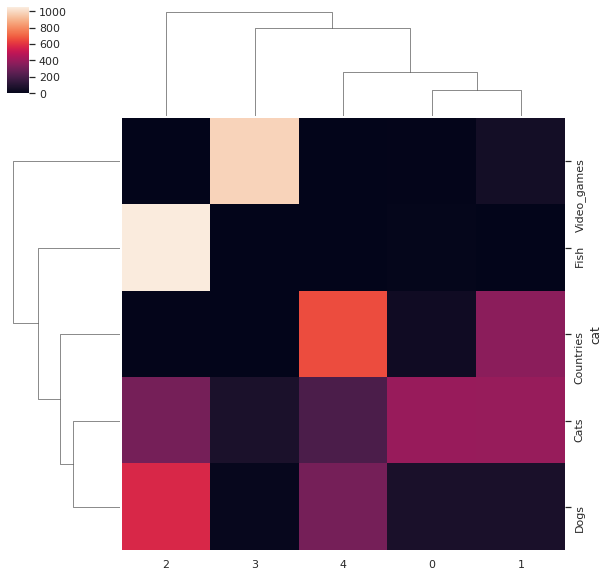

# TWM, Praktikumsbericht 3

Gruppe ZA: Denis Fedjakin, Maximilian Neudert

---

<script type="text/javascript" src="http://cdn.mathjax.org/mathjax/latest/MathJax.js?config=TeX-AMS-MML_HTMLorMML"></script>
<script type="text/x-mathjax-config">
    MathJax.Hub.Config({ tex2jax: {inlineMath: [['$', '$']]}, messageStyle: "none" });
</script>

## Teil I

### 1.

```python
topic_names = {
  0: 'Research',
  1: 'File Sharing',
  2: 'Blog & Forum',
  3: 'People & Life',
  4: 'School',
  5: 'Tech',
  6: 'Local',
  7: 'Adult Content',
  8: 'Geography',
  9: 'Nuclear/Medicine Research',
  10: 'Student',
  11: 'Environmental Research',
  12: 'Travel',
  13: 'Business',
  14: 'Weather',
}
```

Wir haben uns für die oben genannten Topics entschieden.
Anhand der Topwords konnte man einige Topics einfach labeln, wie zum Beispiel `15: 'Weather'` anhand von starken keywords wie `tmp, max, min` oder `2: 'File Sharing'` anhand von `download, magnetic, films`. Andere wiederum haben erst einmal kein klares Bild abgeliefert und wir haben diese dann als unterschiedliche Blogs kategorisiert.

### 2.

Als "adult content" wurde die id `7` identifiziert. Wir filtern die Tabelle mittels

```python
docTopicTableFiltered = docTopicTable[(docTopicTable[7] < 0.5) | (docTopicTable[7].isna())]
```

Es werden `1072` Dokumente entfernt. Das sind etwa 2.5%.

### 3.

Wir schreiben eine Hilfsfunktion

```python
def get_topic_from_loc(df, loc):
  d = docTopicTableFiltered.loc[loc]
  s = d[1:].sort_values(ascending=False)
  url = d.values[0]
  p = np.round(s.values[0], 3)
  tid = s.index[0]
  tname = topic_names[tid]
  print(url)
  print(f'{tname} : {p}%')
```

und untersuchen damit Stichprobenartig die Daten.

- [Dokument 3](http://ducknetweb.blogspot.com/2014/09/aarp-creates-new-tablet-for-seniors.html)
  Was wir als Blog anhand der Topwords klassifiziert haben und es ist ein Blog.
- [Dokument 1510](http://www.komu.com/news/demonstration-planned-at-st-louis-county-outlet-mall/page/2)
  Das Dokument hat eine hohe Topicwahrscheinlichkeit zu Topic 5. Topic 5 hatte von uns als intuitiver Überbegriff Schools.
  Beim Besuchen der Website erkennt man, dass es sich um ein Artikel auf eine News-Seite handelt. Der Artikel geht über eine geplannte Demonstration in einen Einkaufszentrum.
  Dies hat zunächst wenig mit dem Überbegriff zu tun. Wenn man sich aber die enzelne Terme des Topics anschaut, dann kann man mehrere Terme finden, die auch auf der Website verwendet werden (zb. "year", "day", "city", "events", etc.).
  Desweiteren, haben wir beim genaureren Anschauen der Website festgestellt, dass die Seite auf weitere Artikel verlinkt. Dabei gab es Artikel mit Themen, die dem Überbegriff Schools übereinstimmen:
  - Columbia teacher receives \$25,000 educator award
  - MU police arrest woman for having drugs in car with child
- [Dokument 251](http://www.mkweddingphotography.com/warwickshire-wedding-photographer/)
  Das Dokument hat eine hohe Topicwahrscheinlichkeit zu Topic 4. Topic 4 hatte von uns als intuitiver Überbegriff People & Life bekommen.
  Die Website selbst handelt um eine Person, die Fotos für Hochzeiten schießt, was zum Überbegriff People & Life passen würde.

### 4.

Wir nutzen die Hilfsfunktion

```python
def topics_by_p(df, tid1, p1, tid2, p2):
  dff = df[(df[tid1] > p1) & (df[tid2] > p2)]
  print(f'Topic 1: {topic_names[tid1]}, {p1}%')
  print(f'Topic 2: {topic_names[tid2]}, {p2}%')
  return(dff)
```

Wir erhalten:

```python
dff = topics_by_p(df, 9, 0.3, 11, 0.3)
```

Ergebnis: [Dokument 1640](https://www.omicsonline.org/peer-reviewed/underlying-the-mechanism-of-5fluorouracil-and-human-serum-albumininteraction-a-biophysical-study-70785.html)
Die gefilterte Tabelle soll eine Wahrscheinlichkeit von über 30% haben zu den Topics 10 & 12. Diese haben als Überbegriffe "Nuclear/Medicine Research" und "Environmental Research". Deswegen würden wir als Ergebnis irgendwas mit Forschung in diesen Richtungen erwarten. Wir bekommen medizinische Forschung. Passt.

```python
dff = topics_by_p(df, 3, 0.3, 14, 0.3)
```

Ergebnis: [Dokument 1317](https://mysunshinecoast.com.au/business/category/tourism-hospitality-business-sales-brokers,2706)

Die gefilterte Tabelle soll eine Wahrscheinlichkeit von über 30% haben zu den Topics 4 & 15. Diese haben als Überbegriffe "Life & People" und "Weather". Deswegen würden wir als Ergebnis erwarten, dass die Dokumente über Travel gehen.

Die Website handelt über Tourismus und Business Sales an Küstenstädten, was der Topic 4 zusprechen würde. Zudem beinhaltet der Name der Website/Unternehmens das Wort "sunshine", welches auf das Überbegriff "Weather" zutrifft. Der Name wurde auf dieser Website 36 mal verwendet, wodurch sich auch diese Topicwahrscheinlichkeit erklären lässt.

### 5.

Wir nutzen die Hilfsfunktion

```python
def model_by_alpha(alpha):
  new_ldamodelnormal = gensim.models.ldamodel.LdaModel(corpus, num_topics=15, id2word = dictionary, passes=10, chunksize=100, update_every=0, alpha=alpha, random_state=1)
  new_normalv, new_dfnormal = getModelResults(new_ldamodelnormal, corpus, dictionary)
  return(new_ldamodelnormal, new_normalv, new_dfnormal)
```

"The alpha controls the mixture of topics for any given document. Turn it down, and the documents will likely have less of a mixture of topics. Turn it up, and the documents will likely have more of a mixture of topics."
[Quelle](https://medium.com/@lettier/how-does-lda-work-ill-explain-using-emoji-108abf40fa7d)

Das heißt, umso größer das Alpha, umso grobgranularer werden die Topics, das heißt, dass einzelne Dokumente auf mehr Topics verteilt werden.

#### Alpha = 1

Da das vorherige Modell einen alpha-Wert von 1/15 hatte, erwarten wir, dass die Dokumente nun eine gröbere Mischung an Topics haben.



Oben sehen wir das neue Modell mit `alpha=1` und unten das Modell mit `alpha=1/15`.
Der erwartete Effekt tritt ein. Besonders gut zu sehen bei Dokument 6.

### Alpha = 10^-18

Da der Alpha-Wert nun minimal ist, erwarten wir, dass die Dokumente nun sehr wenigen Topics zugewiesen werden.



Es verändert sich nicht viel. Dokument 4 bekommt ein paar Topics abgezogen, aber insbesondere die maximalen Wahrscheinlichkeiten pro Zeile bleiben etwa gleich. Der Parameter alpha ist also recht stark und `1/15` schon sehr niedrig. Das entspricht der Richtung der Erwartung, aber wir hätten mehr erwartet. Zum Beispiel nur noch ein Topic pro Dokument.

## Teil II

### 1.

Wir schauen uns die gelernten Topics an...



Wir stellen fest, dass ungefähre Kategorien der Beschwerden gelernt wurden. Diese genau zu Beschreiben ist etwas schwieriger. Im Prinzip die ersten Paar Wörter legen es etwa fest. Wir definieren:

```python
nhtsa_names = {
  0: 'Lights',
  1: 'Steering Wheel',
  2: 'Brakes',
  3: 'Recall',
  4: 'Light & Brakes',
  5: 'Engine',
  6: 'Fuel',
  7: 'Tires',
  8: 'Windshield',
  9: 'Contacts & Reports'
}
```

und nutzen

```python
def get_desc_from_id(df, cmplid):
  d = df[df['CMPLID'] == cmplid]
  s = pd.Series(d.values[0][1:])
  fix = {0:6, 1:7, 2:8, 3:0, 4:1, 5:9, 6:3, 7:4, 8:2, 9:5}
  s = s.sort_values(ascending=False)
  p = np.round(s.values[0], 3)
  tid = fix[s.index[0]]
  tname = nhtsa_names[tid]
  desc = cmpl[cmpl.CMPLID == cmplid]['CDESCR'].values[0]
  print(desc)
  print(f'{tname} : {p}')
```

dann können wir mittels

```python
df_cars.sort_values(by=0, ascending=False)
```

Ergebnisse aus speziellen Kategorien anschauen.
Das machen wir und stellen fest, dass das Modell schon ziemlich gut funktioniert.
Es finden sich wirklich sehr gute Ergebnisse zu den einzelnen Kategorien.
Suchen wir zum Beispiel nach Recall Artikeln (Sortieren nach 3), dann erhalten wir unter anderem:

> WAS TOLD BY MY AURA DEALER THAT MY VEHICLE WAS UNSAFE TO DRIVE IN MAY 2016. IT HAS BEEN PARKED IN MY GARAGE SINCE THAT TIME\, AWAITING PARTS TO REPAIR OR REPLACE THE TAKATA AIRBAG. I LEASED THE CAR IN DECEMBER 2014\, AND WAS NOT TOLD OF THE RECALL UNTIL MAY 2016\, NOR WAS I TOLD THAT THE CAR HAD A TAKATA AIRBAG WHEN I ENTERED INTO THE LEASE. FOR A PERIOD OF 18 MONTHS\, ANYONE OF MY FAMILY DRIVING THE CAR WOULD HAVE BEEN ENDANGERED IF THE AIRBAGS WERE DEPLOYED. I REQUESTED A MORATORIUM ON LEASE PAYMENTS FROM ACURA LEASING\, UNTIL THE CAR WAS DRIVEABLE\, WHICH THEY REFUSED TO DO. I ASKED THE DEALER\, NAPLETON ACURA TO SWAP OUT THE CAR/LEASE FOR ANOTHER CAR/LEASE WITHOUT THE AIRBAG PROBLEMS\, WHICH THEY WOULD NOT DO WITHOUT A SIGNIFICANT MONETARY PENALTY. THE TAKATA AIRBAGS HAVE BEEN A PROBLEM DATING BACK TO 2001 FOR HONDAS\, AND 2003 FOR ACURAS SO THIS IS A LONG STANDING ISSUE. I DON'T UNDERSTAND WHY YOUR AGENCY ALLOWS ACURA & HONDA TO CONTINUE TO SELL VEHICLES WITH TAKATA AIRBAGS ESPECIALLY IN HIGH HUMIDITY LOCALES SUCH AS FLORIDA\, WHERE I LIVE. YOUR AGENCY SEEMS TO BE PROTECTING THE CAR MANUFACTURERS AND RELATED DEALERS AT THE EXPENSE OF THE PUBLIC THAT YOU ARE SUPPOSED TO BE PROTECTING. IRONICALLY AN AIRBAG IS A SAFETY COMPONENT\, NOT ONE THAT EXPOSES THE DRIVER TO SERIOUS INJURY OR DEATH. AT THIS POINT\, I WOULD LIKE TO GIVE THE CAR BACK TO ACURA\, AND TERMINATE THE LEASE WITHOUT PENALTY.

Oder für eine zufällige ID:

```python
get_desc_from_id(df_cars, 1478410)
```

> FIRST LARGE CRACK APPEARED JUST 4 MONTHS AFTER PURCHASING THE CAR IN AUGUST 31\, 2016 AT A FAIRLY SLOW SPEED (UNDER 40 MPH). SECOND CRACK APPEARED MAY 2018. THE THIRD AND LARGEST CRACK HAPPENED JUNE 30\, 2018\, AGAIN AT A FAIRLY SLOW SPEED.

`Windshield : 0.534`

Das passt sehr gut. Ähnlich bei den anderen Kategorien. Die machen Sinn.
Damit lässt sich mit dem Modell gut nach Schadensarten suchen. Was damit nicht geht ist nach Herstellern oder Ähnliches.

### 2.

Wir definieren eine Funktion zum mapping der Topics.

```python
def get_best_topic(row):
  s = row[1:].sort_values(ascending=False)
  tid = s.index[0]
  return(tid)
```

und mappen diese auf das DataFrame.

```python
df_cars['topic'] = df_cars.apply(lambda row: get_best_topic(row), axis=1)
```

Der Vektor `docCats` ist nicht gegeben. Wir erstellen diesen selbst:

```python
doc_cats = list(cmpl['COMPDESC'].drop_duplicates())
```

Anschließend fügen wir `COMPDESC` zum DataFrame hinzu.

```python
pd.concat([relevantComplaints.reset_index()['COMPDESC'], df_cars], axis=1)
```

Nun wollen wir mit dem Randindex die Genauigkeit des Clusterings messen.
Wir haben 10 Topics, aber nur 6 Werte für `COMPDESC` und da die Kategorien auch sonst nur bedingt viel miteinander zu tun haben, müssen wir diese erst sinnvoll mappen. Das gibt dem Score einen gewisses Bias.

```python
comp = {
  'SERVICE BRAKES' : [2, 4],
  'AIR BAGS' : [1, 3, 4, 7, 9],
  'WHEELS' : [7],
  'EXTERIOR LIGHTING' : [0, 4],
  'FUEL/PROPULSION SYSTEM' : [5,6],
  'VISIBILITY/WIPER' : [8]
}
```

damit Berechnen wir dann den Randindex

```python
def match_check(row):
  desc = row['COMPDESC']
  targets = comp[desc]
  tid = row['topic']
  check = tid in targets
  return(int(check))

df_check = df_cars.apply(lambda row: match_check(row), axis=1)
n = len(df_check)
t = len(df_check[df_check == 1])
acc = t/n

print(acc)
```

und erhalten eine Genauigkeit von `0.5828566239898302`.
Würden wir raten, dann wären wir bei einer Genauigkeit von `0.166`, also liefert das Clustering ein gutes, aber nicht besonderes Ergebnis. Hierbei ist der oben erwähnte menschliche Bias noch zu beachten. Alles in allem ist das Ergebnis in Ordnung.

### 3.

Wir bauen die Kreuztabelle:

```python
def mapx(row):
  l = [0] * 10
  l[row['topic']] = 1
  names = ['COMPDESC'] + list(range(10))
  s = pd.Series([row['COMPDESC']] + l, index=names)
  return(s)

xtable = df_cars[['COMPDESC'] + list(range(10)) + ['topic']]
xtable = xtable.apply(lambda row: mapx(row), axis=1)
xtable = xtable.groupby('COMPDESC').sum()
```



Mit der Heatmap können wir nun sehen, welche Kategorien mit den Topics korellieren.
Zum Beispiel, der von uns als `Lights` klassifizierte Topic korreliert mit `Exterior Lightning` und `Visibility/Wiper`. Das passt gut.

Damit können wir dann auch die Klassifizierung für den Randindex besser einschätzen und neu berechnen:

```python
comp = {
    'SERVICE BRAKES' : [5, 9, 2, 4],
    'AIR BAGS' : [1, 3, 7, 9],
    'WHEELS' : [7,1],
    'EXTERIOR LIGHTING' : [0, 4],
    'FUEL/PROPULSION SYSTEM' : [5,3,6],
    'VISIBILITY/WIPER' : [0, 8]
}
df_check = df_cars.apply(lambda row: match_check(row), axis=1)
n = len(df_check)
t = len(df_check[df_check == 1])
acc = t/n
print(acc)
```

Wir erhalten dann eine Genauigkeit von `0.7698174884227731`.

## Teil III

### Vorbereitung

Wir nutzen das gecrawlte Wikipedia nach den Kategorien:
`Cats, Dogs, Fish, Video_games, Contries`

Diese haben wir aus Hana als `csv` exportiert und laden diese in ein Pandas DataFrame. Anschließend verfahren wir wie bei Teil I. Es war noch etwas Datenbereinigung (Leere Texte) nötig und kleine triviale Anpassungen hier und da (Spaltennamen usw).
Wir belassen es bei Alpha `1/15` und setzen die Anzahl an Kategorien auf 5, denn dies ist, wonach wir crawled haben.

### Topic Generation

Wir visualisieren die Topics.

 
 


Wir stellen fest, dass unterschiedliche Kategorien gebildet wurden, als Wikipedia es eingegliedert hat. Ein paar Dinge fallen auf:

- Kategorie 3: Scheint Tiere zu sein. Dogs, Cats, Fish, breed, ... enthalten
- Kategorie 4: Scheint Games zu sein. Game, Games, mario, nintendo, ... enthalten.
- Die restlichen Kategorien sind fraglich. Wir definieren:

```python
topic_names = {
  0: 'Cat Games',
  1: 'Games & Movies',
  2: 'Animals',
  3: 'Video Games',
  4: 'War & Kingdoms'
}
```

Schauen wir uns Stichprobenartig Dokumente an, so erhalten wir unter anderem:

- [Dokument 1500](https://en.wikipedia.org/wiki/Newton_Park)
  Unser Label "Cat Games" passt überhaupt nicht. Ein zufällig sehr schlechter Treffer insbesondere, da `p = 0.998`. Es ist ein Park.
- [Dokument 1](https://en.wikipedia.org/wiki/Dog_behaviourist)
  Unser Label "Animals" passt da schon ganz gut.
- [Dokument 1551](https://en.wikipedia.org/wiki/Diana_in_Search_of_Herself)
  Es schleicht der Verdacht, dass es sich bei Kategorie 0 um Kultur handelt.
- [Dokument 1451](https://en.wikipedia.org/wiki/Sabrina:_The_Animated_Series)
  Ist eine animierte Serie und kein Spiel. In den Topwords für die Kategorie ist auch video enthalten. Und die Kategorie Film und Fernsehn gibt es sogesehen ja nicht.

Was wir lernen ist, dass interessante Kategorien gelernt werden, welche auf den ersten Blick gar nicht so eindeutig sind und mit der Vorgabe nicht gerade übereinstimmen.

Bedenkt man die dieses durchaus unterschiedliche Clustering, so macht es keinen Sinn den Randindex auf den externen Klassen zu berechnen.

Wir erstellen die Heatmap über die Kreuztabelle:



und vergleichen mit der von uns getroffenen Auswahl an Kategorien:

```python
topic_names = {
  0: 'Cat Games',
  1: 'Games & Movies',
  2: 'Animals',
  3: 'Video Games',
  4: 'War & Kingdoms'
}
```

Wir stellen fest, dass die Fische fast vollständig unter Tieren gelandet sind und Video Games ebenso ihre Kategorie bekommen haben.
Bei Countries geht es wohl größtenteils um Kriege und Könige. Das mit im Nachhinein auch Sinn, weil die Königstümer viel länger Bestand hatten als unsere moderne Demokratie und Kriege gab es damals auch immer.
